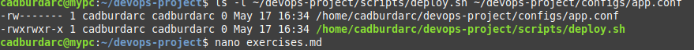
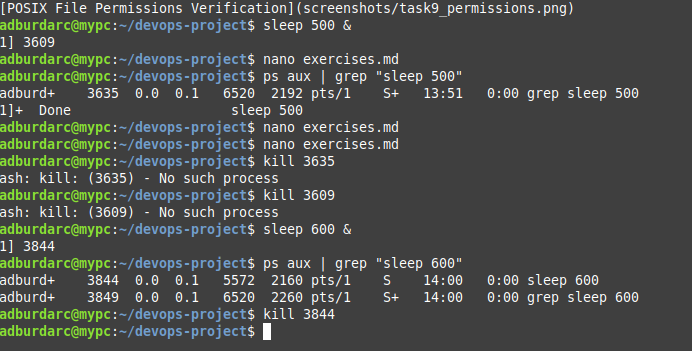
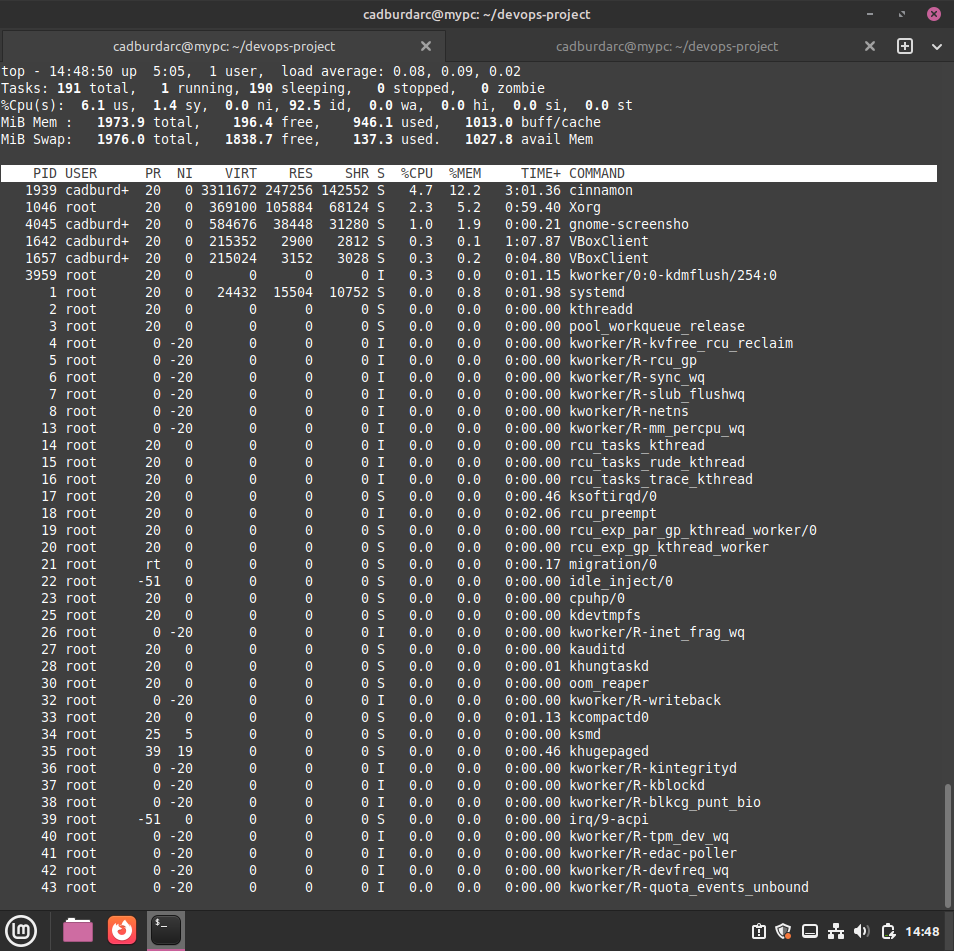
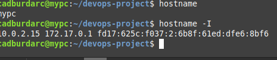
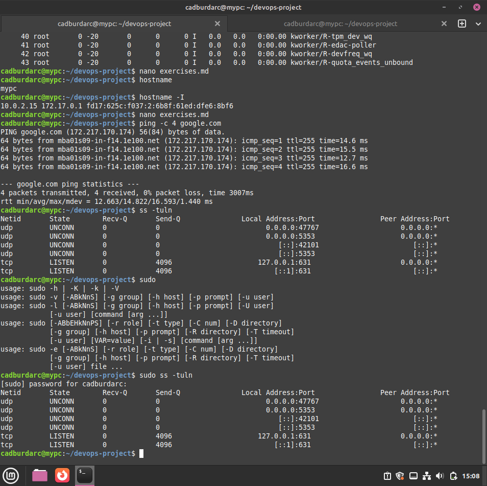
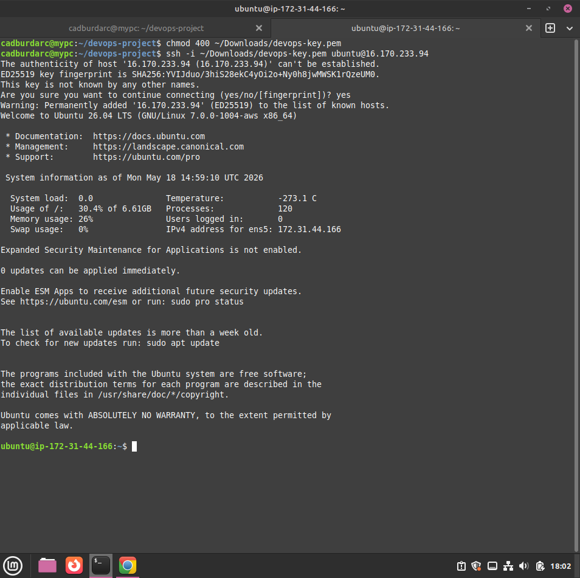
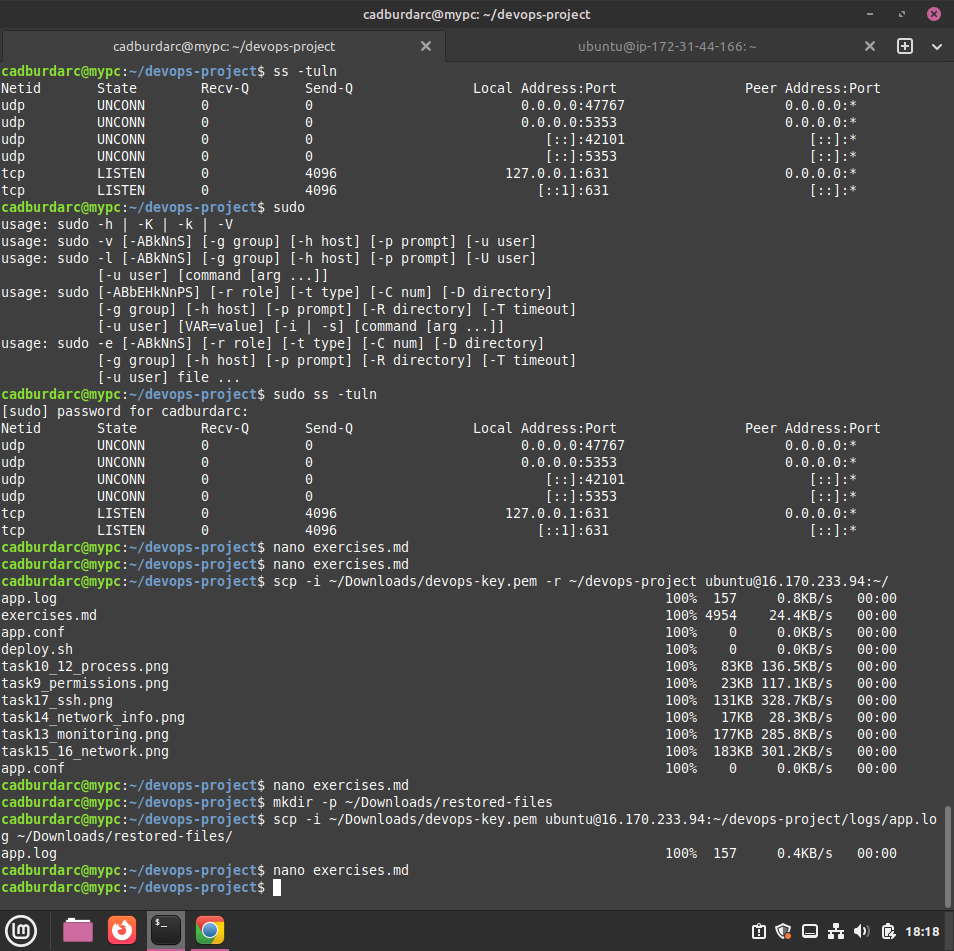
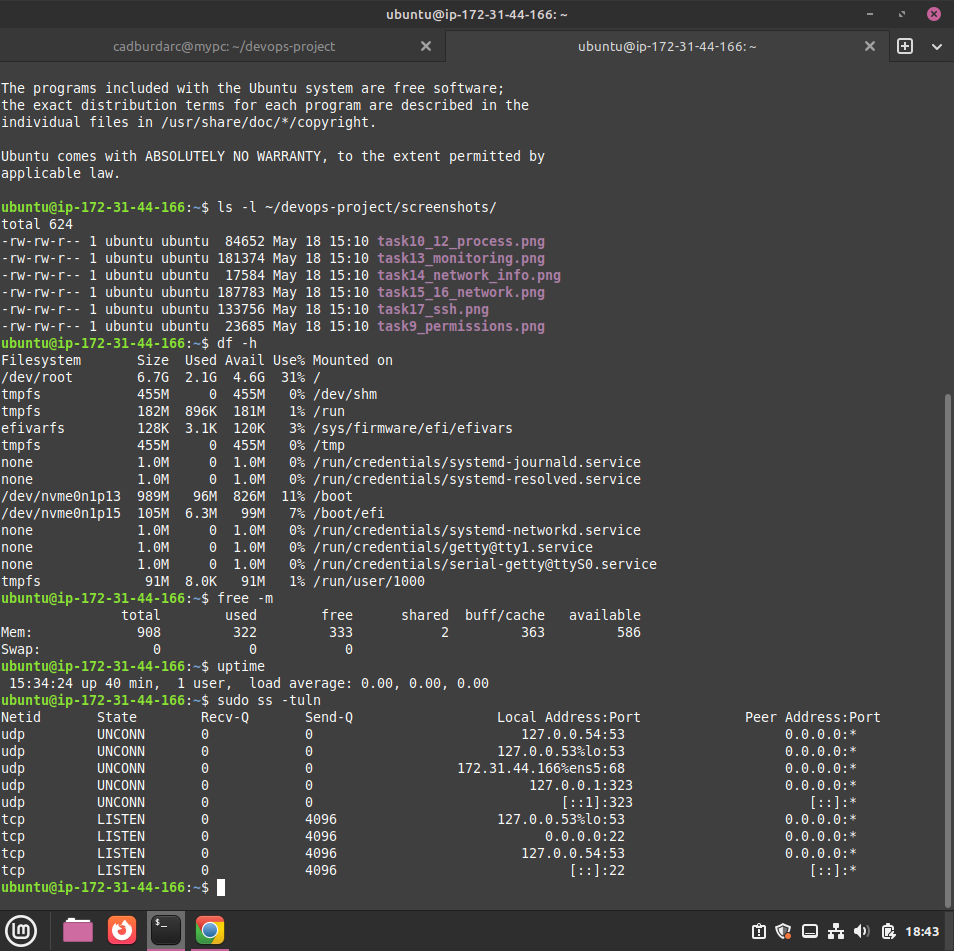
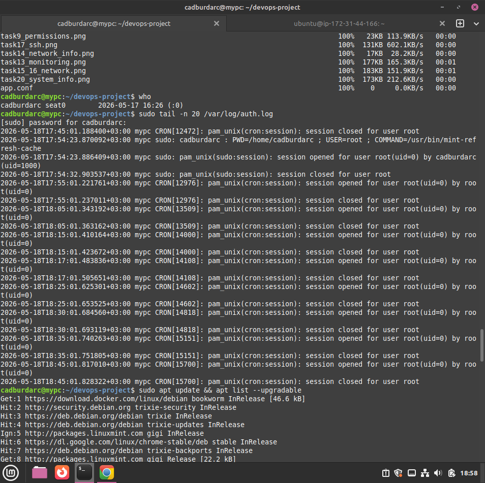

## Task 9 — Explain Permissions

Linux file system security relies on a 3-digit octal notation system. Each digit manages access for a specific tier of users in a strict hierarchical order:

1. **First Digit:** The **User** (Individual account that owns the file)
2. **Second Digit:** The **Group** (Users assigned to the file's primary group)
3. **Third Digit:** **Others** (Any other global account on the local system)

The access rights are calculated mathematically by summing the binary bitmask values of the desired capabilities:

- **Read (r)** = `4`
- **Write (w)** = `2`
- **Execute (x)** = `1`
- **No Permission (-)** = `0`

---

### 1. Code `755` (`rwxr-xr-x`)

- **User Allocation (4+2+1=7):** Granted full Read, Write, and Execution privileges.
- **Group Allocation (4+0+1=5):** Granted Read and Execution access; denied modification capabilities.
- **Others Allocation (4+0+1=5):** Granted global Read and Execution access; denied modification capabilities.
- This configuration is standard for shared utility software, scripts (like our `deploy.sh`), and directory structures. It allows non-root service accounts and general system processes to execute the program without permitting them to alter or corrupt the underlying source code.

### 2. Code `644` (`rw-r--r--`)

- **User Allocation (4+2+0=6):** Granted Read and Write access; cannot be executed as an application.
- **Group Allocation (4+0+0=4):** Isolated to a Read-Only state.
- **Others Allocation (4+0+0=4):** Isolated to a Read-Only state globally.
- The baseline default for standard system files, text documentation, and public web assets. It permits web servers (like Nginx or Apache) to read and host the file contents while locking out all edit privileges to anyone except the owner.

### 3. Code `600` (`rw-------`)

- **User Allocation (4+2+0=6):** Granted absolute Read and Write capabilities to safely interact with the file.
- **Group Allocation (0):** Total access denial.
- **Others Allocation (0):** Total access denial.
- Critical high-security credential lockdown. This is required for safeguarding infrastructure connection configurations (like our `app.conf`), internal private keys, and application environment variables. It directly enforces the security principle of least privilege, preventing horizontal data visibility or local privilege escalation breaches.

---

### Verified Permissions Environment

The screenshot below confirms the successful implementation of the permission states configured during Tasks 7 and 8:



---

## Task 10 — Start Background Process

To simulate a long-running, continuous application or service without locking up the active terminal user interface, the `sleep` utility was executed and pushed directly into the background using the trailing ampersand (`&`) operator:

```bash
sleep 600 &
```
# Task 11 — Identify Process

To trace and verify the execution state of our background operation, the global system process table was audited using the Process Status (`ps aux`) tool combined with a pipeline filter (`grep`) to isolate its specific Process ID (PID) and command mapping:

```bash
ps aux | grep "sleep 600"
```

- **Identified Process Name:** `sleep 600`
- **Identified PID:** `3844`
- In a live environment, process tracking is fundamental when monitoring background daemons, microservices, or disconnected scripts. Combining `ps aux` with a `grep` pipeline allows engineers to quickly extract exact runtime metrics, process ownership, and unique PIDs required for lifecycle management.

---

# Task 12 — Terminate Process

Using the validated PID (`3844`), a standard termination signal (`SIGTERM`) was delivered directly to the target background thread to stop it cleanly and safely release kernel resource allocations:

```bash
kill 3844
```



- Terminating unresponsive background components using their distinct PIDs prevents CPU degradation and volatile memory leaks. Utilizing standard `kill` issues a friendly exit signal, enabling programs to execute clean-up routines before dropping off the system thread tracker.

---

# Task 13 — Monitor System

To inspect global system resource performance, resource volatility, and running kernel threads across the active host architecture, the interactive real-time system monitor tool was executed:

```bash
top
```



- Real-time dashboards are crucial for troubleshooting unexpected infrastructure degradation. Monitoring active CPU load, volatile memory thresholds, and high-consumption process signatures allows network operations teams to catch scaling issues before they disrupt production application stability.
# Task 14 — Find Server IP

To discover the local machine identity, internal network interface bounds, and active network layer addressing layouts, the core network configuration parameters were queried:

```bash
hostname
hostname -I
```



- Tracking host identity and binding IPs is vital when scaling multi-tier computing infrastructure. Verifying whether a server is bound to an interface correctly ensures backend web services, databases, and microservices can discover each other securely over internal routing tables.

---

# Task 15 — Test Connectivity

To verify external internet layer reachability and validate outbound network transport paths from the local virtual machine context, a 4-packet ICMP echo request was transmitted directly to a public internet namespace:

```bash
ping -c 4 google.com
```

---

# Task 16 — Verify Listening Ports

To confirm that local edge ingress channels, such as the SSH secure administration interface (Port 22), are actively bound and ready to accept incoming client connections, socket configurations were deeply audited:

```bash
ss -tuln
```



- Connectivity checks form the bedrock of perimeter security audits and firewall troubleshooting. While `ping` rapidly isolates structural routing breaks or external DNS resolution failure, checking listening ports with `ss` confirms that local applications are securely up and bound to their target transport ports.

---
# Task 17 — Remote Access (Local to Remote)

To establish a secure, encrypted remote administrative session with the cloud-hosted AWS EC2 Ubuntu instance, local identity key rules were strictly locked down, and a secure SSH transport tunnel was initialized:

```bash
# Set secure read-only permission on the downloaded private key
chmod 400 ~/Downloads/devops-key.pem

# Securely connect to the AWS instance
ssh -i ~/Downloads/devops-key.pem ubuntu@16.170.233.94
```



- Inter-server cloud access relies on the asymmetric cryptography protocol of Secure Shell (SSH). Restricting identity credential flags to `400` ensures that other local system users cannot access or compromise the private key, completely satisfying stringent enterprise cloud access security frameworks.

---

# Task 18 — Secure File Transfer

The complete local workspace file structure (`devops-project/`) was securely and recursively uploaded over an encrypted system transport layer directly to the remote AWS EC2 instance deployment context using Secure Copy (`scp`):

```bash
scp -i ~/Downloads/devops-key.pem -r ~/devops-project ubuntu@16.170.233.94:~/
```

---

# Task 19 — Retrieve File (Remote to Local)

To validate structural file download patterns from cloud architectures back down to edge workspaces, a specific application runtime log archive was extracted from the distant AWS host repository:

```bash
# Download target log file from AWS EC2 instance
scp -i ~/Downloads/devops-key.pem ubuntu@16.170.233.94:~/devops-project/logs/app.log ~/Downloads/restored-files/
```



- Secure Copy (`scp`) provides an immutable, reliable transport link for staging deployment packages or aggregating scattered diagnostic assets. Using recursive tracking (`-r`) pushes deep nested architectures in one unified administrative movement, making it highly useful for ad-hoc backup recovery workflows.

---

# Task 20 — Resource Monitoring & System Metrics

To thoroughly audit host operating health, volume configurations, active memory constraints, and current kernel thread queues, a full administrative diagnostic check was completed:

```bash
# Display human-readable file system disk space usage
df -h

# Display total and available system memory metrics in megabytes
free -m

# Output current system uptime, logged-in sessions, and load averages
uptime

# Audit active listening TCP/UDP network ports and sockets
sudo ss -tuln
```



- Running these baseline terminal utilities together provides an instant health checklist for any Linux node. Monitoring storage thresholds ensures log files do not exhaust storage blocks, tracking memory prevents kernel out-of-memory panics, and assessing system load reveals exactly how much stress the underlying host is under.
# Task 21 to 23 — Log Auditing, Session Tracking & Package Management

To conclude the architectural health assessment, secure host log tails were scanned for system exceptions, active user connections were audited, and system package manager index states were reviewed:

```bash
# Task 21: View the final 20 lines of security authentication logs
sudo tail -n 20 /var/log/auth.log

# Task 22: List currently authenticated user sessions
who

# Task 23: Audit system repositories for available security updates
sudo apt update && sudo apt list --upgradable
```



- Tracking user identity traces via `who` and scanning authentication logs via `auth.log` prevents privilege abuse and alerts teams to anomalous credential tracking patterns. Coupling this with package patch audits keeps the server operating system updated against known structural security vulnerabilities.
