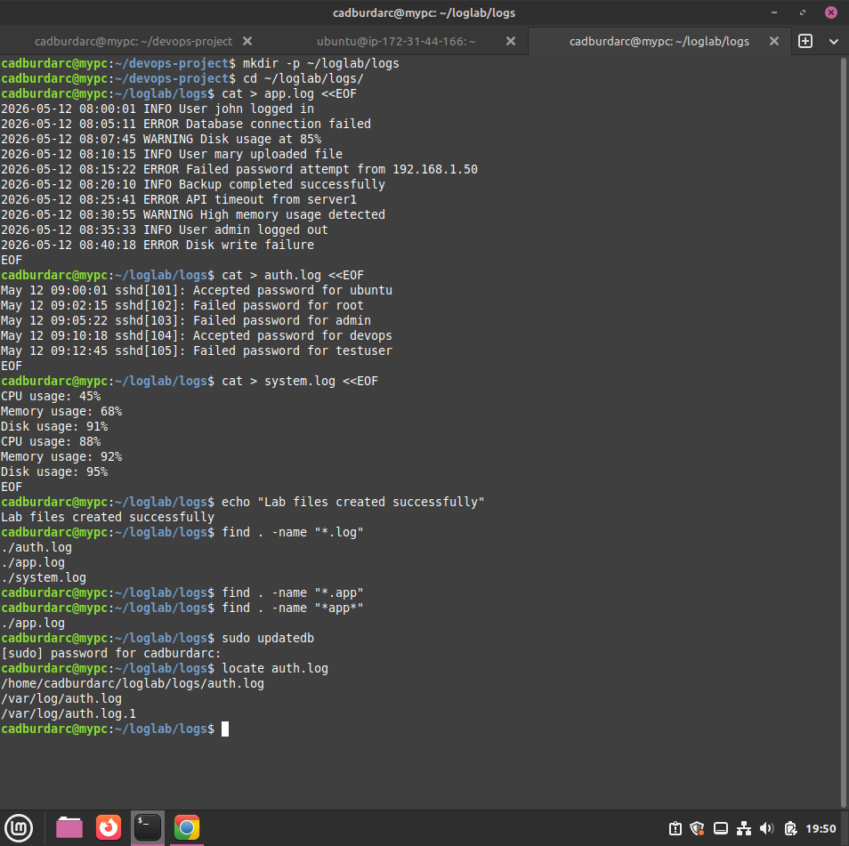
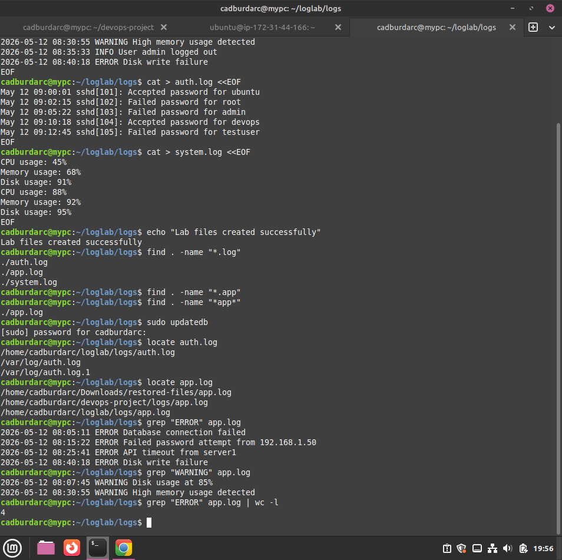
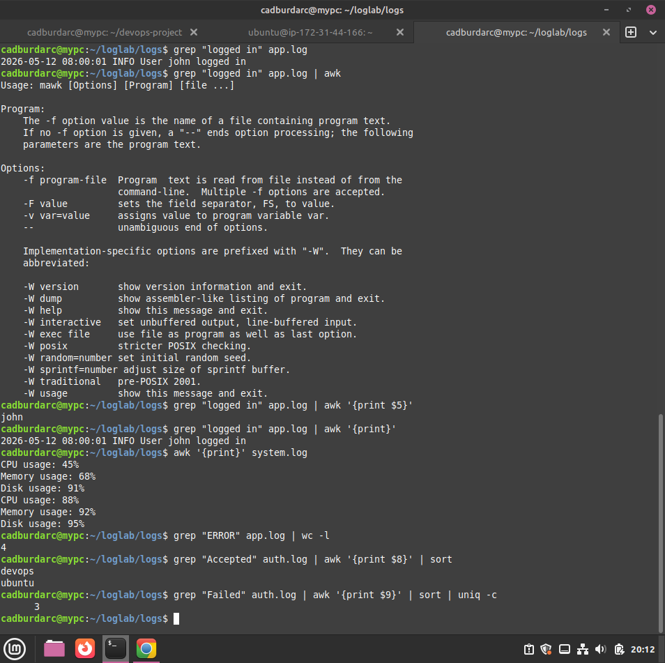
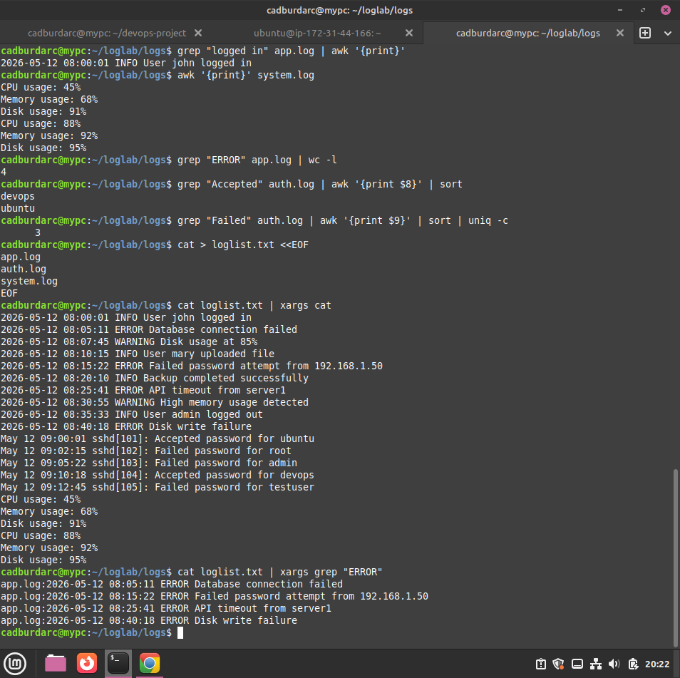

<h1>DevOps Infrastructure Log Analysis Lab</h1>

<strong>System Environment:</strong> Linux Mint Debian Edition 7 (LMDE 7)

<strong>Objective:</strong> Apply Linux text-processing and file-system discovery utilities (<code>find</code>, <code>locate</code>, <code>grep</code>, <code>awk</code>, <code>xargs</code>) to parse system, authentication, and application log metrics.

<h2>PART 1 & 2 — File System Discovery (find & locate)</h2>

<h3>Task 1: Find all .log files in the workspace</h3>

To scan the local tracking context for files ending with the log extension, the wildcard string was passed to the evaluation subsystem:

<pre><code>find . -name "*.log"</code></pre>

Output captured:

<pre><code>./app.log
./auth.log
./system.log</code></pre>

<h3>Task 2: Match files containing "app" in the filename</h3>
<pre><code>find . -name "*app*"</code></pre>

Output captured:

<pre><code>./app.log</code></pre>

<h3>Task 3: Locate auth.log via indexing system</h3>

Because locate reads from a pre-built indexed database rather than scanning the physical disk live, the index database was refreshed before searching:

<pre><code>sudo updatedb
locate auth.log</code></pre>

<h2>PART 3 — Pattern Matching (grep)</h2>

<h3>Task 4 & 5: Isolate ERROR and WARNING states from app.log</h3>
<pre><code># Filter Error States
grep "ERROR" app.log

# Filter Warning Alerts
grep "WARNING" app.log</code></pre>

Output captured:

<pre><code>2026-05-12 08:05:11 ERROR Database connection failed
2026-05-12 08:15:22 ERROR Failed password attempt from 192.168.1.50
2026-05-12 08:25:41 ERROR API timeout from server1
2026-05-12 08:40:18 ERROR Disk write failure

2026-05-12 08:07:45 WARNING Disk usage at 85%
2026-05-12 08:30:55 WARNING High memory usage detected</code></pre>

<h3>Task 6: Quantitative Line Counting for Errors</h3>

By utilizing a pipe (|), the standard output stream of the matching routine was redirected to the line-counting engine:

<pre><code>grep "ERROR" app.log | wc -l</code></pre>

Resulting Count: 4

<h2>PART 4 — Column Formatting & Token Extraction (awk)</h2>

<h3>Task 7: Isolate Structural Timestamps</h3>

awk processes lines as blank-space separated grids. The first two columns containing date and runtime markers were isolated:

<pre><code>awk '{print $1, $2}' app.log</code></pre>

Output captured:

<pre><code>2026-05-12 08:00:01
2026-05-12 08:05:11
2026-05-12 08:07:45
...</code></pre>

<h3>Task 8: Extract Successful Authentications</h3>
<pre><code>grep "logged in" app.log | awk '{print $5}'</code></pre>

Extracted Principal User: john

<h3>Task 9: Extract Metric Arrays from System State Logs</h3>
<pre><code>awk '{print $3}' system.log</code></pre>

Collected Metrics:

<pre><code>45%
68%
91%
88%
92%
95%</code></pre>

<h2>PART 5 & 6 — Advanced Pipelines and Argument Bridging (xargs)</h2>

<h3>Task 10, 11 & 12: Chained Pipeline Redirection</h3>
<pre><code># Task 10: Count of Application Errors
grep "ERROR" app.log | wc -l

# Task 11: Alphabetical Sorting of Allowed Users
grep "Accepted" auth.log | awk '{print $8}' | sort

# Task 12: Frequency Counting of Failed Secure Shell Operations
grep "Failed" auth.log | awk '{print $9}' | sort | uniq -c</code></pre>

Task 11 Output:

<pre><code>devops
ubuntu</code></pre>

Task 12 Output:

<pre><code>      1 admin
      1 root
      1 testuser</code></pre>

<h3>Task 13, 14 & 15: Execution Argument Translation via xargs</h3>

A manifest tracking file named loglist.txt was verified. Because cat and grep process standard terminal strings as targeting arguments rather than linear text inputs, xargs was applied as an execution link:

<pre><code># Task 14: Read list file entries and batch display raw log segments
cat loglist.txt | xargs cat

# Task 15: Batch scan all log vectors listed inside the manifest file
cat loglist.txt | xargs grep "ERROR"</code></pre>

Task 15 Output:

<pre><code>app.log:2026-05-12 08:05:11 ERROR Database connection failed
app.log:2026-05-12 08:15:22 ERROR Failed password attempt from 192.168.1.50
app.log:2026-05-12 08:25:41 ERROR API timeout from server1
app.log:2026-05-12 08:40:18 ERROR Disk write failure</code></pre>

<h2>ADVANCED CHALLENGE — SYSTEM INSTABILITY ANALYSIS</h2>

<h3>1. Identify Disk Issue</h3>

Scanning the log targets explicitly highlights a severe storage boundary warning and subsequent physical writing anomalies:

<ul>
  <li><code>system.log</code>: Tracks a critical spike in system metrics up to <strong>Disk usage: 95%</strong>.</li>
  <li><code>app.log</code>: Records a catastrophic hardware execution block: <strong>ERROR Disk write failure</strong>.</li>
</ul>

<h3>2. Identify Failed Logins</h3>

Analyzing malicious access indicators inside auth.log maps a clear pattern of unauthorized credential testing:

<ul>
  <li><strong>Target targets:</strong> Three distinct bad authentications executed back-to-back targeting privileged system accounts (<code>root</code>, <code>admin</code>, and <code>testuser</code>).</li>
</ul>

<h3>3. Total Error Volume Metric</h3>

Running an integrated pipeline across all production assets shows that the system registers exactly <strong>4</strong> critical error entries, all concentrated within the application tier.

<h3>4. Locate Target Diagnostic Repositories</h3>

The active monitoring logs are structurally isolated within the specific workspace node:

<ul>
  <li><strong>Core path:</strong> <code>~/loglab/logs/</code></li>
</ul>

<h3>5. System Health Summary Statement</h3>
<blockquote>
  
<strong>CRITICAL CONDITION ALERT:</strong> The server environment is structurally unstable. The primary operational bottleneck is localized to storage capacity saturation, which has escalated to a hard disk write failure (95% disk footprint threshold). Concurrently, the perimeter firewall shows trace patterns of a localized brute-force security threat via active authentication failures against system service processes. Immediate intervention required: expand the storage array partition and enforce active ip-blocking mechanics on active nodes.

</blockquote>
