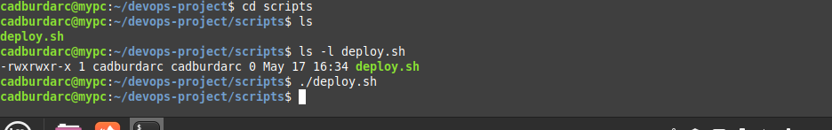
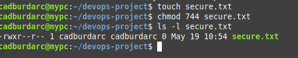
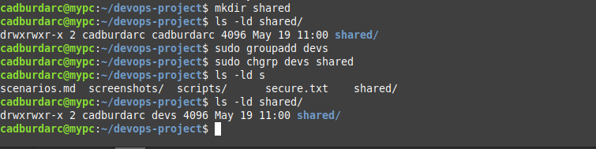
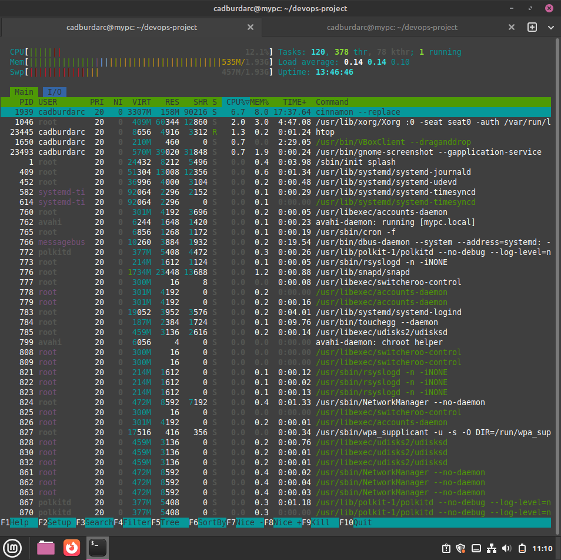
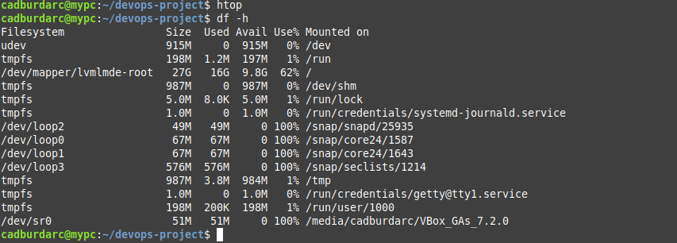
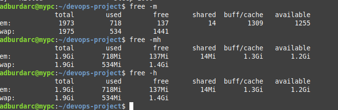
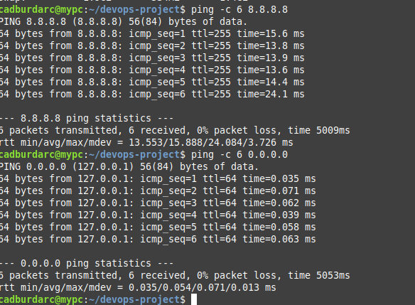
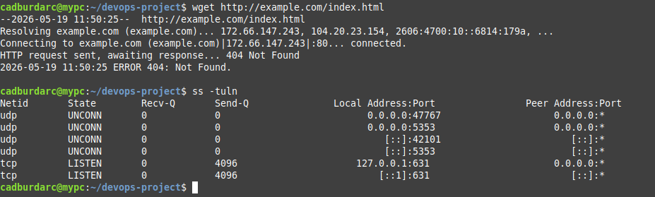
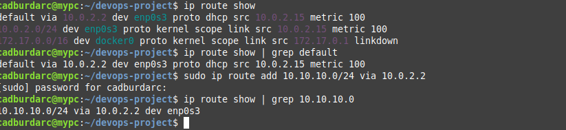
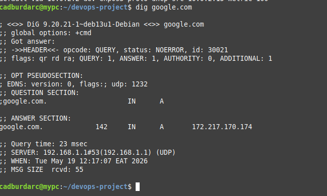

# DevOps Infrastructure Technical Scen
ario Analysis
**System Environment:** Linux Mint Debian Edition 7 (LMDE 7)  

## File Management Scenarios

### 1. Relocating a Misplaced File
* **Scenario:** A file was accidentally generated in an incorrect directory path.
* **Solution:** Use the `mv` (move) utility to relocate the target file to the designated path.
```bash
mv filename.txt /home/ubuntu/projects/
### 2. Nested Single-Command Directory Creation
* **Scenario:** The environment requires a uniform directory architecture setup for logs, scripts, and backups.
* **Solution:** Execute `mkdir` with brace expansion to evaluate and spin up the folders in one command.
```bash
mkdir -p /path/to/project/{logs,scripts,backups}
### 3. Storage Optimization: Locate, Relocate, and Purge
* **Scenario:** A large backup archive is saturating storage block space.
* **Solution:**
```bash
# Locate the large file by size (looking for files over 40MB)
find . -type f -size +40M

# Copy the target file to the backup directory
cp huge_backup.tar.gz backups/

# Purge the original file to reclaim disk blocks
rm huge_backup.tar.gz

### 4. Live Production Application Log Tailing
* **Scenario:** A web application is failing. The logs are stored in: /var/log/app.log. How would you view the latest logs and continuously monitor updates?
* **Solution:** Use the `tail` utility to see the bottom of the file, and apply the `-f` flag to track live adjustments stream-side.
```bash
# View the latest log entries
tail /var/log/app.log

# Continuously monitor updates live
tail -f /var/log/app.log
### 5. Scanning for Target Database Failures
* **Scenario:** You suspect the application has database errors. How would you search the log file for ERROR?
* **Solution:** Filter the log entries with the `grep` utility to scan the target log file and pull out only the lines containing the specific failure token.
```bash
grep "ERROR" logs/app.log
### 6. Interactive Large-File Pagination Inspection
* **Scenario:** A configuration file is very large, which command would help you scroll through it page by page?* **Solution:** Pass the target configuration file to the `less` utility, which opens an interactive terminal interface allowing you to scroll through the data page-by-page using the keyboard arrows without flooding your terminal screen buffer.
```bash
less logs/app.log
## Permissions & Ownership Scenarios

### 7. Execution Permission Denied Resolution
* **Scenario:** A deployment script called deploy.sh fails with: Permission denied. How would you fix it?* **Solution:** Modify the file mode bits using the `chmod` utility with the `+x` flag to grant the resource explicit execution permissions across the runtime interface.
```bash
chmod +x scripts/deploy.sh

### 8. System Resource Ownership Alteration
* **Scenario:** You need to change the owner of a file named report.txt to a user named developer. How would you do that?* **Solution:** Execute the `chown` utility prefixed with `sudo` administrative privileges to reassign the user ownership field of the target resource.
```bash
sudo chown developer report.txt

### 9. Absolute File Permissions Mask Configuration
* **Scenario:** How would you grant read, write, and execute permissions to the owner, but only read permissions to everyone else for a file named secure.txt?* **Solution:** Apply the absolute numeric permissions mask `744` using the `chmod` utility to cleanly map the target permissions matrix to the owner, group, and public scopes.
```bash
chmod 744 secure.txt

### 10. Group Infrastructure Ownership Modification
* **Scenario:** You want to make a directory named shared accessible to a group named devs. How would you change the group ownership of this directory?* **Solution:** Utilize the `chgrp` utility prefixed with `sudo` administrative privileges to explicitly reassign the group ownership field of the designated directory resource.
```bash
sudo chgrp devs shared

## System Information & Process Management Scenarios

### 11. Real-Time System Resource Monitoring
* **Scenario:** Your server is running slow. Which command would you use to see running processes and resource usage in real-time?* **Solution:** Launch the interactive `top` utility to open a live administrative dashboard tracking CPU load, memory utilization, and active system process threads.
```bash
htop

### 12. Human-Readable Storage Volume Inspection
* **Scenario:** How do you check the available disk space on your Linux system in a human-readable format?* **Solution:** Execute the `df` utility with the `-h` human-readable flag to output a structured summary of file system space utilization metrics.
```bash
df -h

### 13. Granular Directory Storage Footprint Analysis
* **Scenario:** How can you view the size of a specific directory and all its contents?* **Solution:** Invoke the `du` utility with the `-s` summary and `-h` human-readable flags to compute and display the total storage footprint block allocation of the target directory path.
```bash
du -sh ~/devops-project

### 14. Unresponsive Process Force Termination
* **Scenario:** A process with ID 1234 is frozen and needs to be stopped immediately. Which command would you use?* **Solution:** Issue the `kill` utility configured with the `-9` SIGKILL signal flag against the targeted Process ID (PID) to force the kernel to instantly terminate the runtime instance.
```bash
kill -9 1234
### 15. Real-Time Memory Capacity Volatility Check
* **Scenario:** You need to check how much free RAM (memory) is available on the server. Which command would you run?* **Solution:** Execute the `free` utility modified with the `-h` flag to render a human-readable structural grid summarizing the system's total, consumed, and available volatile memory allocations.
```bash
free -h

## Networking & Connectivity Scenarios

### 16. Remote Host Network Layer Reachability Verification
* **Scenario:** You want to check if a remote server at IP address 192.168.1.50 is reachable. Which utility would you use?* **Solution:** Deploy the `ping` utility configured with a specific packet limit to transmit ICMP Echo Requests and assess link latency and connectivity metrics to the target host interface.
```bash
ping -c 6 8.8.8.8

### 17. Remote Resource Command-Line Ingestion
* **Scenario:** How would you download a file from a URL like http://example.com/file.tar.gz using the command line?* **Solution:** Invoke the `wget` network download utility against the remote uniform resource locator to automatically pull and save the file system archive directly into the local directory.
```bash
wget [http://example.com/file.tar.gz](http://example.com/file.tar.gz)
### 18. Active Network Socket and Listening Port Extraction
* **Scenario:** You need to see all active network connections and listening ports on your machine. Which command would you use?* **Solution:** Execute the `ss` utility with the `-tuln` flags to display a numeric breakdown of all active, listening TCP and UDP transport layer socket bindings.
```bash
ss -tuln

### 19. Kernel Routing Table Inspection and Configuration
* **Scenario:** How would you add a static routing entry or check the kernel routing table on your Linux machine?* **Solution:** Use the `ip route` utility to show active routes, or append administrative arguments to insert an explicit static gateway route for a specific subnet interface.
```bash
# To view the table:
ip route show

# To add a static route:
sudo ip route add 192.168.2.0/24 via 192.168.1.1

### 20. Domain Name System Record Resolution
* **Scenario:** How do you look up the DNS records (like the IP address) of a domain name such as google.com from the terminal?* **Solution:** Execute the `dig` utility against the target domain name to query authoritative name servers and extract the corresponding network layer IP mapping from the answer section.
```bash
dig google.com

## Archiving, Backup, & Package Management Scenarios

### 21. Compressed File System Archive Creation
* **Scenario:** How would you create a compressed backup archive of a directory named logs into a file called logs_backup.tar.gz?* **Solution:** Deploy the `tar` utility configured with creation, gzip compression, verbose tracking, and destination file flags (`-czvf`) against the target directory resource.
```bash
tar -czvf logs_backup.tar.gz logs
-c (Create a new archive)

-z (Compress the archive using gzip)

-v (Verbosely list the files being processed)

-f (Specify the filename of the resulting archive file)
### 22. Compressed File System Archive Extraction
* **Scenario:** You have a compressed archive file named backup.tar.gz. How would you extract its contents into the current directory?* **Solution:** Execute the `tar` utility configured with extraction, gzip decompression, verbose tracking, and source file flags (`-xzvf`) against the target archive package.
```bash
tar -xzvf backup.tar.gz
### 23. Package Repository Package Index Synchronization
* **Scenario:** You want to update your Linux system's package list to make sure you can install the latest versions of software. Which command do you run on Ubuntu/Debian?* **Solution:** Invoke the `apt` package manager with the `update` command argument, prefixed with `sudo` administration privileges, to synchronize the local package cache with remote distribution repositories.
```bash
sudo apt update
### 24. System-Wide Software Package Upgrade Execution
* **Scenario:** After updating the package list, how do you actually upgrade all installed packages on an Ubuntu/Debian system to their latest versions?* **Solution:** Execute the `apt` package manager using the `upgrade` command modifier combined with administrative `sudo` elevation to pull down and deploy the latest system-wide package binaries.
```bash
sudo apt upgrade -y
### 25. Target Software Package Installation
* **Scenario:** How do you install a new package, such as the network tool curl, on an Ubuntu system?* **Solution:** Deploy the `apt` package utility with the `install` command and target package argument, elevated by `sudo` privileges, to download and register the software binary.
```bash
sudo apt install -y curl

